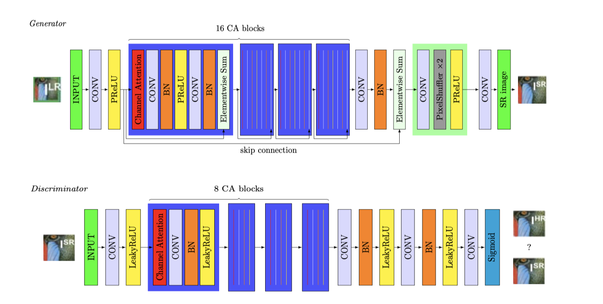
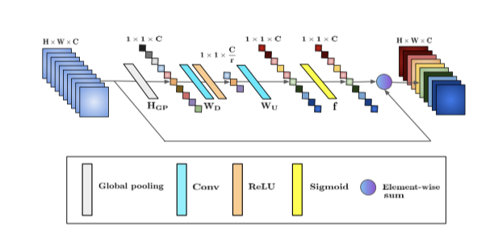
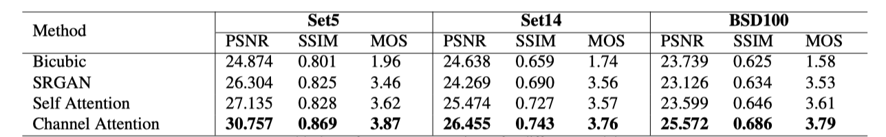
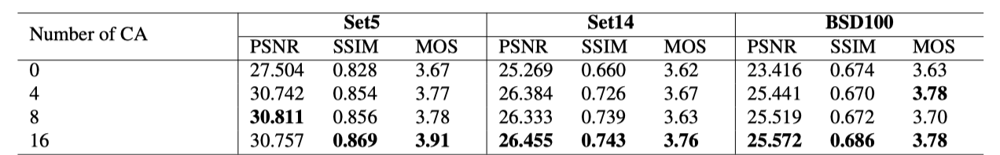
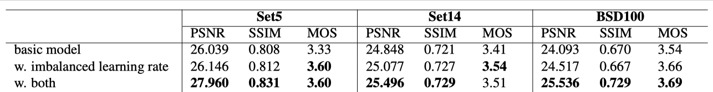
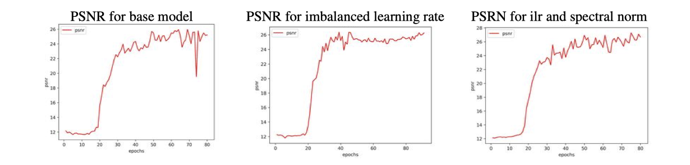
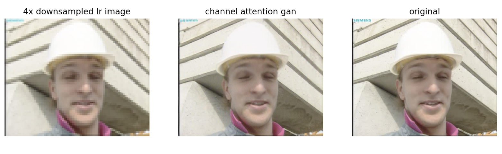
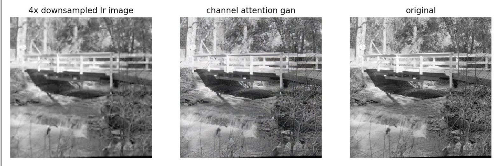
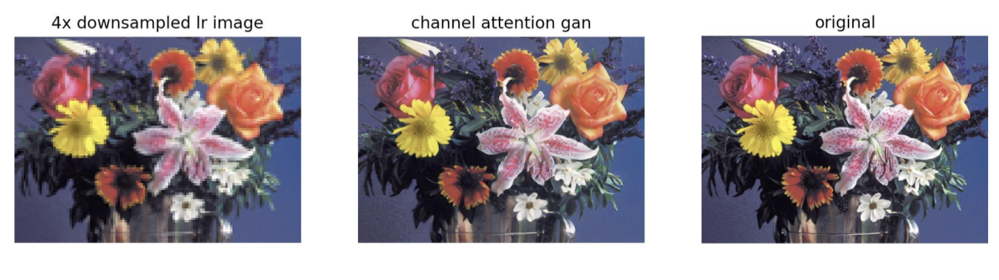

# ENGN8536 Project: Single-Image-Super-Resolution-Using-a-Channel-Attention-GAN

Project of Advanced Topics in Mechatronics Systems(Deep Learning in Computer Vision)

[PROJECT REPORT](https://github.com/redlessme/Single-Image-Super-Resolution-Using-a-Channel-Attention-GAN-/blob/main/project_report.pdf)  
[Presentation slide](https://github.com/redlessme/Single-Image-Super-Resolution-Using-a-Channel-Attention-GAN-/blob/main/p8.pdf)  

### Introduction

We proposed a channel attention GAN and verified that our model outperforms state-of-the-art model SRGAN.

### Our contribution
We proposed a novel self adversarial learning architecture that leveraged the HRNet, increased estimation accuracy when occlusions and implausible poses are presented.

We designed a boundary equilibrium scheme for our adversarial training, by balancing the learning speed for our discriminator, we proved that our adversarial training strategy is more stable and can avoid mode collapse when using HRNet as the backbone.

### Architecture

### Channel Attention block

## Experiment Results

### Comparision

### Ablation study

### Stablization strategies

### Visualization of the attention maps

### Results

### Video demo

## Most Related Papers
[Photo-Realistic Single Image Super-Resolution Using a Generative Adversarial Network.](https://arxiv.org/abs/1609.04802)

[Deep Residual Learning for Image Recognition.](https://arxiv.org/abs/1512.03385)

[Squeeze-and-Excitation Networks.](https://arxiv.org/abs/1709.01507)

[Image Super-Resolution Using Very Deep Residual Channel Attention Networks.](https://arxiv.org/abs/1807.02758)

[Self-Attention Generative Adversarial Networks.](https://arxiv.org/abs/1805.08318)

