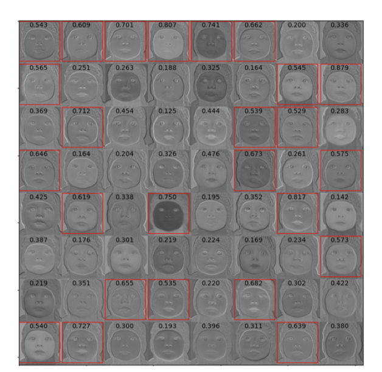

# ENGN8536 Project: Single-Image-Super-Resolution-Using-a-Self-Attention-GAN

Project of Advanced Topics in Mechatronics Systems(Deep Learning in Computer Vision)

[PROJECT REPORT](https://github.com/redlessme/Single-Image-Super-Resolution-Using-a-Self-Attention-GAN/blob/master/8501_project_report.pdf)  
[Presentation slide](https://github.com/redlessme/Single-Image-Super-Resolution-Using-a-Self-Attention-GAN/blob/master/8501.pdf)  

### Introduction

We proposed a channel attention GAN and verified that our model outperforms state-of-the-art model SRGAN.

### Our contribution
We proposed a novel self adversarial learning architecture that leveraged the HRNet, increased estimation accuracy when occlusions and implausible poses are presented.

We designed a boundary equilibrium scheme for our adversarial training, by balancing the learning speed for our discriminator, we proved that our adversarial training strategy is more stable and can avoid mode collapse when using HRNet as the backbone.

### Architecture

### Channel Attention block

## Experiment Results

### Comparision

### Ablation study

### Stablization strategies

### Visualization of the attention maps

### Results

### Video demo

## Related Paper
long-range pixel dependencies: J. Kim, J. K. Lee, and K. M. Lee. Deeply-recursive convolutional network for image super-resolution. In IEEE Conference on Computer Vision and Pattern Recognition (CVPR), 2016.
Improved SRGAN: Enhanced Super-Resolution Generative Adversarial Networks

[M. Bojarski et al., ”End to end learning for selfdriving
cars,” arXiv preprint arXiv:1604.07316, 2016.](https://arxiv.org/abs/1604.07316)  
[Sentdex's py gtav](https://github.com/Sentdex/pygta5)  

